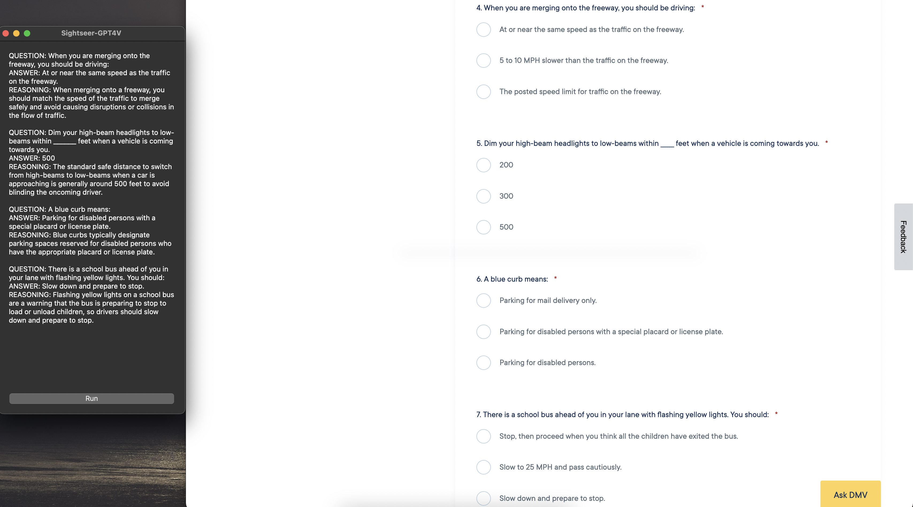

# Sightseer

Welcome to Sightseer, a program designed to assist with quizzes and exams using GPT-4V technology.

## Features

- **Screenshot Interpretation**: Takes a snapshot of your screen, interprets any visible quiz or exam questions, provides answers and explanations where possible.
- **Cross-Platform Support**: Works on Windows, Linux, and Mac OS platforms.
- **Intuitive Interface**: Simple UI to get assistance in a sidebar window.
- **AI-powered insights**: Utilizes GPT-4V to process visual information and answer textually.



## Prerequisites

Before running Sightseer, ensure you have the following prerequisites set up on your system:

- Python 3.6+
- pip (Python package installer)
- Access to OpenAI API and a valid API key.

## Installation

To run Sightseer on your local machine, please follow these steps:

1. Clone this repository or download the source code.
2. Navigate to the project directory in your terminal.
3. Install the required dependencies:

   ```bash
   pip install -r requirements.txt
   ```

4. Set up your OpenAI API key in a `.env` file:

   ```bash
   OPENAI_API_KEY='your_api_key_here'
   ```

## Usage

To start using Sightseer, run the following command in your terminal:

```bash
python main.py
```
After starting the application, open a quiz or exam side-by-side to the Sightseer window. Click the `Run` button to process the questions on screen.

### Disclaimer for Responsible Use and Academic Integrity

Sightseer is provided as an educational tool intended for responsible use only. It's essential to remember that using such assistance in academic settings may violate academic integrity policies. Users are strongly advised to adhere to the following guidelines:

- **Ethical Conduct**: Utilize Sightseer in good faith for legitimate educational purposes that do not infringe upon the principles of academic integrity.
- **Honesty**: Do not use Sightseer to engage in cheating, plagiarism, or any deceitful actions in an academic environment.
- **Compliance with Policies**: Always comply with the rules and regulations set forth by your educational institution or testing body regarding the use of external assistance.

**By using Sightseer, you agree to use it ethically, lawfully, and in compliance with your educational institution's rules on academic integrity and honesty. The creators of Sightseer will not be held responsible for any misuse of the tool or any repercussions that come from such misuse.**
